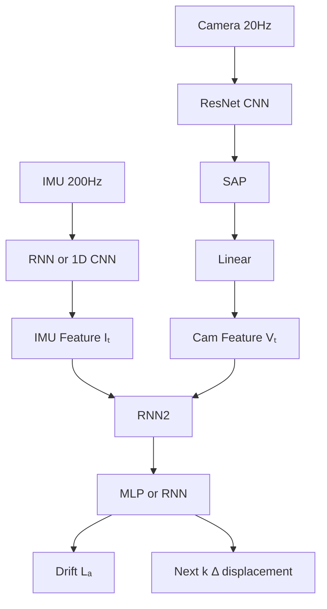

```mermaid
graph TD
    IMU[IMU 200Hz] --> RNN1[RNN or 1D CNN]
    RNN1 --> I[IMU Feature Iₜ]

    CAM[Camera 20Hz] --> ResNet[ResNet CNN]
    ResNet --> SAP
    SAP --> Linear
    Linear --> V[Cam Feature Vₜ]

    I --> RNN2
    V --> RNN2

    RNN2 --> Head[MLP or RNN]
    Head --> Drift[Drift Lₐ]
    Head --> Displacement[Next k Δ displacement]
```
