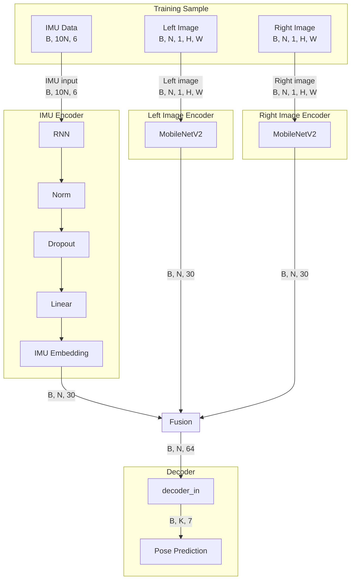

```mermaid
graph TD

    subgraph Train[Training Sample]
        LeftImage_Data[Left Image<br>B, N, 1, H, W]
        RightImage_Data[Right Image<br>B, N, 1, H, W]
        IMU_Data[IMU Data<br>B, 10N, 6]
    end

    IMU_Data -->|IMU input<br>B, 10N, 6| imu_rnn
    LeftImage_Data -->|Left image<br>B, N, 1, H, W| l_image_branch
    RightImage_Data -->|Right image<br>B, N, 1, H, W| r_image_branch

    subgraph IMU_Branch[IMU Encoder<br>IMUEncoder]
        imu_rnn[RNN] --> imu_norm[Norm]
        imu_norm --> imu_dropout[Dropout]
        imu_dropout --> imu_linear[Linear]
        imu_linear --> imu_out[IMU Embedding]
    end

    subgraph LI_Branch[Left Image Encoder]
        l_image_branch[MobileNetV2]
    end

    subgraph RI_Branch[Right Image Encoder]
        r_image_branch[MobileNetV2]
    end

    imu_out -->|B, N, 30| Fusion
    l_image_branch -->|B, N, 30| Fusion
    r_image_branch -->|B, N, 30| Fusion

    subgraph Fusion
    end

    Fusion -->|B, N, 64| decoder_in
    subgraph Decoder[Decoder]
        decoder_in -->|B, K, 7| Pred[Pose Prediction]
    end
```
